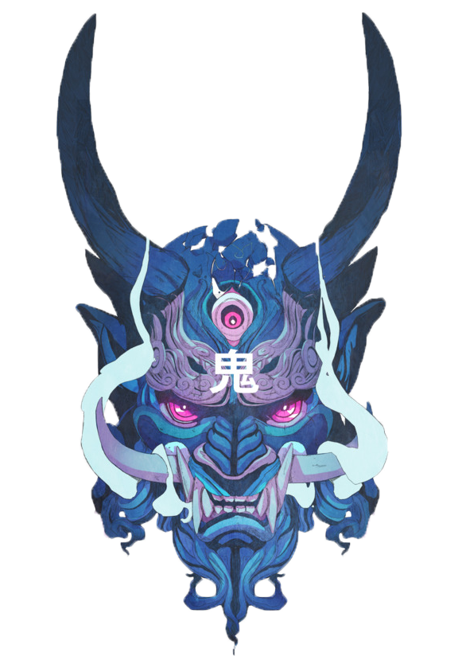

	

<h1 align="center">oni</h1>

Personal nvim configuration structure and documentation. An ever growing list of cool things that can be done with nvim...

<b>⚠️ this file is auto-generated ⚠️</b>

  

